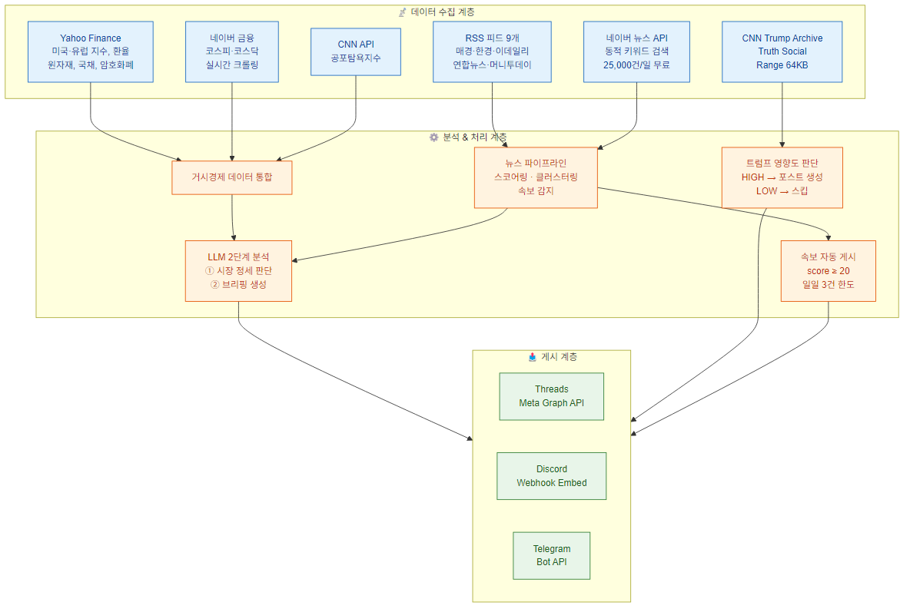
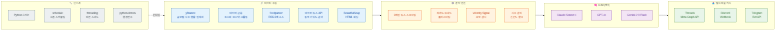
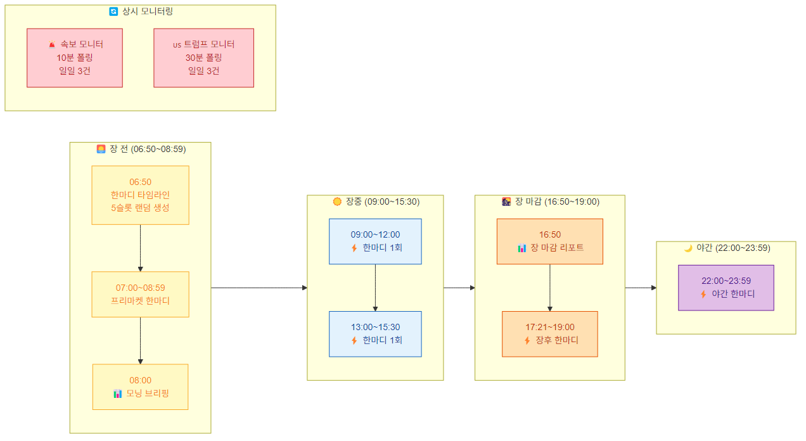
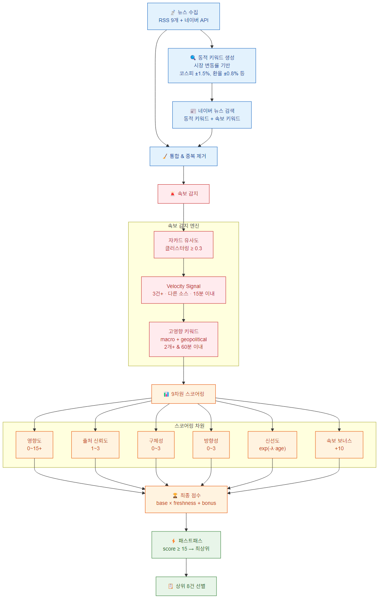
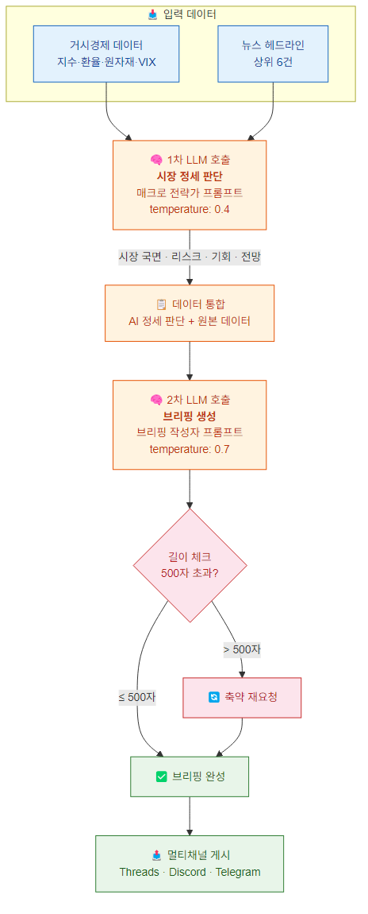

# 📊 Trend Analyzer Demo

실시간 주식 시장 데이터를 수집하고, LLM으로 분석하여 Threads / Discord / Telegram에 자동 브리핑을 게시하는 봇입니다.

> 뉴스 수집 → 속보 감지 → LLM 시장 분석 → 멀티 채널 자동 게시

---

## 🏗️ 시스템 아키텍처

전체 시스템은 데이터 수집 → 분석/처리 → 게시의 3계층 구조로 동작합니다.



- 6개 외부 데이터 소스에서 거시경제 지표와 뉴스를 실시간 수집
- 뉴스 스코어링, 속보 감지, 트럼프 모니터링을 거쳐 LLM 2단계 분석 수행
- 분석 결과를 Threads, Discord, Telegram 3개 채널에 동시 게시

---

## 🔧 기술 스택



| 구분 | 기술 |
|------|------|
| 언어 | Python 3.10+ |
| LLM | Claude Sonnet 4 / GPT-4o / Gemini 2.0 Flash (택1) |
| 데이터 수집 | yfinance, 네이버 금융 크롤링, feedparser (RSS), 네이버 뉴스 API |
| 속보 감지 | 자카드 유사도 클러스터링 + Velocity Signal + 지수 감쇠 신선도 |
| SNS 게시 | Threads (Meta Graph API), Discord Webhook, Telegram Bot API |
| 스케줄링 | schedule + threading.Timer (데몬 스레드) |

---

## ⏰ 하루 운영 타임라인

봇은 장 전부터 야간까지 자동으로 스케줄에 따라 동작합니다.



| 시간 | 이벤트 |
|------|--------|
| 06:50 | 📋 한마디 타임라인 생성 (5슬롯 랜덤 시간 배정) |
| 07:00~08:59 | ⚡ 프리마켓 한마디 |
| 08:00 | 📊 모닝 브리핑 (장 전 데이터 기반) |
| 09:00~15:30 | ⚡ 장중 한마디 2회 |
| 16:50 | 📊 장 마감 리포트 |
| 17:21~19:00 | ⚡ 장후 한마디 |
| 22:00~23:59 | ⚡ 야간 한마디 |
| 상시 | 🚨 속보 자동 게시 (10분 폴링, 일일 3건) |
| 상시 | 🇺🇸 트럼프 모니터 (30분 폴링, 일일 3건) |

---

## 🎯 핵심 기능

### 1. 뉴스 수집 & 속보 감지

- RSS 피드 9개 소스 + 네이버 뉴스 API로 실시간 뉴스 수집
- 9차원 다차원 스코어링으로 뉴스 중요도 자동 평가
- 자카드 유사도 기반 주제 클러스터링 + Velocity Signal로 속보 자동 감지
- 지수 감쇠 함수(`exp(-λ × age)`)로 신선도 반영

### 2. 거시경제 데이터 수집

- Yahoo Finance: 미국 3대 지수, 선물, VIX, 환율, 원자재, 국채, 비트코인
- 네이버 금융: 코스피/코스닥 실시간 크롤링 (yfinance 폴백)
- CNN: 공포탐욕지수 (API → 크롤링 → VIX 기반 추정 3단계 폴백)
- 유럽 지수: 유로스톡스50, DAX

### 3. LLM 기반 2단계 분석 & 브리핑 생성

- 1차: 매크로 전략가 관점에서 시장 국면/리스크/기회 분석
- 2차: 분석 결과 + 원본 데이터로 500자 이내 브리핑 생성

### 4. 트럼프 Truth Social 모니터

- CNN 아카이브에서 트럼프 최신 글 수집 (Range 헤더로 64KB만 요청)
- LLM이 한국 주식시장 영향도 판단 (HIGH/LOW)
- HIGH 판정 시 자동으로 시장 영향 분석 포스트 생성 & 게시

### 5. 속보 자동 게시

- 10분 간격 폴링으로 고영향 속보 감지 (score ≥ 20)
- 자카드 유사도 기반 중복 방지, 일일 3건 한도 + 15분 쿨다운

### 6. 멀티 채널 동시 게시

- **Threads**: Meta Graph API (본문 + 테마 댓글 분리)
- **Discord**: Embed 카드 형식 (뉴스 헤드라인 + 브리핑)
- **Telegram**: Bot API 메시지 전송

---

## 📡 뉴스 수집 & 스코어링 파이프라인 상세



### 6단계 파이프라인

```
[1단계] RSS 피드 9개 소스 수집 (API 키 불필요)
  국내: 매경증권, 한경금융, 이데일리증권, 연합뉴스경제, 머니투데이
  글로벌: 한경글로벌, 매경국제 / 테마: 매경IT / 속보: 연합뉴스속보

[2단계] 시장 데이터 기반 동적 키워드 자동 생성 (LLM 호출 없음)
  코스피/코스닥 ±1.5% → "코스피 급락/급등"
  달러원 ±0.8% → "환율 원달러"
  WTI ±2% → "유가 급등/급락"
  나스닥 ±1.5% → "나스닥 미국증시 하락/상승"

[3단계] 네이버 뉴스 API로 동적 + 고정 키워드 검색 (보강)

[4단계] 속보 감지 (Breaking News Detection)
  자카드 유사도(≥0.3) 클러스터링 → Velocity Signal 감지
  → 고영향 키워드 매칭 → breaking_score 계산

[5단계] 9차원 통합 스코어링 + 신선도 감쇠

[6단계] 패스트패스(score ≥ 15 최상위) + 최종 8건 선별
```

### 뉴스 스코어링 (9차원)

| 차원 | 설명 | 범위 |
|------|------|------|
| 영향도 (impact) | 키워드 사전 매칭 (매크로/지정학/수급/기업/섹터) | 0~15+ |
| 출처 신뢰도 | 연합뉴스/한경=3, 매경/머니투데이=2, 기타=1 | 1~3 |
| 구체성 | 수치/종목명/금액 포함 여부 | 0~3 |
| 시장 방향성 | 급락/폭등 등 강한 톤 키워드 | 0~3 |
| 신선도 | `exp(-0.005 × age_minutes)` — 0분=1.0, 1시간=0.74, 24시간≈0 | 0~1 |
| 속보 보너스 | Velocity Signal 감지 시 +10 | 0/10 |
| **최종** | `(영향도+신뢰도+구체성+방향성) × 신선도 + 속보보너스` | |

### 속보 감지 로직

```
뉴스 수집 → 자카드 유사도 클러스터링 (≥0.3)
  → Velocity Signal: 동일 주제 3건+ / 다른 소스 / 15분 이내
    → 고영향 키워드: macro+geopolitical 2개+ & 60분 이내
      → breaking_score 계산 → 패스트패스 (≥15) 최상위 배치
```

---

## 🧠 LLM 2단계 브리핑 생성



```
[1차 호출] 매크로 전략가 프롬프트
  입력: 거시경제 데이터 + 뉴스 헤드라인
  출력: 시장 국면/리스크/기회/전망 (500자)

[2차 호출] 브리핑 작성자 프롬프트
  입력: 1차 분석 + 원본 데이터
  출력: 번호 리스트 10항목 브리핑 (500자)
  → 초과 시 축약 재요청
```

### 모닝 브리핑 (08:00)

장 시작 전이므로 한국 지수는 "전일 종가"임을 명시하고, 미국 선물/야간 지표 기반으로 오늘 장 방향성을 전망합니다.

```
{날짜} - 어제 밤부터 아침사이에 일어난 일

1. 나스닥 ▼1.2%, S&P500 ▼0.8%
2. 원유 98달러 ▲2.8%, 환율 1,505원
3~8. 주요 뉴스 6건 (각 25자 이내)
9. 오늘 장 전망 한줄
10. 팔로우&하트로 매일 속보와 브리핑 확인
```

### 장 마감 리포트 (16:50)

본문 + `---THEME---` 구분자로 테마 댓글을 분리하여 reply 체인으로 자동 게시합니다.

```
{날짜} - 오늘 주식 시장 일어난 일
[한줄요약 25자 이내]

1. 코스피 지수 + 등락률
2. 코스닥 + 환율 또는 수급
3~8. 주요 뉴스 6건 (각 25자 이내)
9. 내일 전망 한줄
10. 팔로우&하트로 매일 속보와 브리핑 확인
```

### 프롬프트 설계 원칙

- 역할 부여: "20년 경력 매크로 전략가", "주식시장 전문 브리핑 작성자"
- 데이터 기반: "제공된 데이터의 실제 수치만 사용"
- 포맷 강제: 번호 리스트 10항목, 각 25자 이내 (Threads 모바일 한 줄에 딱 맞게)
- 길이 제한: 500자 이내 (초과 시 축약 재요청)

---

## 🚨 속보 전용 자동 게시

score ≥ 20인 고영향 속보를 감지하면 정규 스케줄과 별개로 즉시 게시합니다.

```
[BreakingNewsMonitor] 데몬 스레드 (10분 폴링)
  → fetch_news() → score ≥ 20 속보 필터
    → 자카드 유사도 중복 체크
      → 쿨다운 15분 + 일일 3건 한도 체크
        → LLM 속보 전용 포스트 생성 (500자)
          → Threads + Discord + Telegram 게시
```

---

## 🇺🇸 트럼프 Truth Social 모니터

트럼프의 Truth Social 포스트를 실시간 모니터링하여, 한국 주식시장/글로벌 경제에 영향이 큰 발언을 감지하면 자동으로 포스트를 게시합니다.

```
[TrumpMonitor] 데몬 스레드 (30분 폴링)
  → CNN 아카이브 JSON에서 최신 글 수집 (Range 헤더로 64KB만 요청)
    → 마지막 확인 ID 이후 새 글만 필터링
      → LLM 영향도 판단 (HIGH / LOW)
        → HIGH: 시장 영향 분석 포스트 생성 → 게시
        → LOW: 스킵 (생일 축하, 정치 공격, 개인 자랑 등)
```

| 판정 | 기준 | 예시 |
|------|------|------|
| HIGH | 관세/무역, 금리/연준, 전쟁/군사, 에너지/원유, 중국/한국 언급 | 이란 군사 공격 5일 연기, 중국 관세 25% 부과 |
| LOW | 생일 축하, 정치 공격, 선거 캠페인, 개인 자랑, 미국 내정 | "HAPPY BIRTHDAY", 민주당 비판, 시청률 자랑 |

---

## 📰 Discord / Telegram 뉴스 헤드라인

게시물이 올라가는 시점에 선별된 뉴스 헤드라인을 Discord Embed 카드 + Telegram 메시지로 동시 전송합니다.

```
모닝 브리핑 게시 → 상위 8건 뉴스 (context: "모닝 브리핑")
장 마감 리포트 게시 → 상위 8건 뉴스 (context: "장 마감")
장중 한마디 게시 → 상위 8건 뉴스 (context: "한마디")
속보 게시 → 해당 속보 1건 (context: "🚨 속보")
트럼프 HIGH 판정 → 해당 발언 1건 (context: "🇺🇸 트럼프")
```

| 이모지 | 기준 |
|--------|------|
| 🚨 | 속보 (fast_path) |
| 🔴 | 고영향 (score ≥ 4) |
| 🟡 | 중영향 (score ≥ 2) |
| ⚪ | 일반 |

---

## 🛡️ Threads 스팸 필터 방지

Meta의 자동 스팸 감지 시스템 대응 조치:

| 조치 | 내용 | 효과 |
|------|------|------|
| 링크 본문 통합 | 속보/트럼프 링크를 reply 분리 대신 본문 하단에 포함 | reply 0건, 게시 1건으로 통합 |
| 테마 댓글 딜레이 | 본문 게시 후 30~60초 랜덤 대기 후 테마 댓글 게시 | 사람 패턴에 가깝게 |
| 소수점 정수 변환 | 10.66 → 11 자동 변환 | 스팸 필터 트리거 방지 |
| 일일 게시 수 제한 | 브리핑 2 + 한마디 5 + 속보 3 + 트럼프 3 = 최대 ~15건 | 과다 게시 방지 |

---

## 🤖 LLM 사용 & 비용

### 지원 모델

| Provider | 모델 | 용도 |
|----------|------|------|
| Anthropic | Claude Sonnet 4 | 시장 분석, 브리핑 생성, 속보 요약, 트럼프 영향도 판단 |
| OpenAI | GPT-4o | 동일 |
| Google | Gemini 2.0 Flash | 동일 |

### 일일 LLM 호출 현황

| 기능 | 호출 횟수/일 | 용도 |
|------|-------------|------|
| 모닝 브리핑 | 2~3회 | 정세 판단 + 브리핑 생성 + (축약) |
| 장 마감 리포트 | 2~3회 | 정세 판단 + 브리핑 생성 + (축약) |
| 장중 한마디 | 5회 | 한마디 생성 |
| 속보 자동 게시 | 0~3회 | 속보 요약 |
| 트럼프 모니터 | 10~20회 | 영향도 판단 (대부분 LOW) |
| **합계** | **~20~35회/일** | |

### 월간 비용 (개장일 22일 기준)

| 모델 | 최소 | 일반 | 최대 |
|------|------|------|------|
| Claude Sonnet 4 | ~$2 | ~$3~5 | ~$5~7 |
| GPT-4o | ~$2 | ~$3~5 | ~$5~7 |
| Gemini 2.0 Flash | ~$0.1 | ~$0.3 | ~$0.5 |

> 네이버 검색 API (25,000건/일), Discord 웹훅, Threads API, Telegram Bot API, RSS 피드: 모두 무료

---

## 📡 데이터 소스

| 소스 | 데이터 | 비용 |
|------|--------|------|
| Yahoo Finance (yfinance) | 미국/한국/유럽 지수, 환율, 원자재, 국채, 암호화폐 | 무료 |
| 네이버 금융 크롤링 | 코스피/코스닥 실시간 | 무료 |
| RSS 피드 9개 | 매경, 한경, 이데일리, 연합뉴스, 머니투데이 등 | 무료 |
| 네이버 뉴스 API | 동적 키워드 기반 뉴스 검색 | 무료 (25,000건/일) |
| CNN Fear & Greed | 공포탐욕지수 | 무료 |
| CNN Trump Archive | 트럼프 Truth Social 포스트 | 무료 |

---

## 📝 로그 & 리소스

| 파일 | 내용 |
|------|------|
| `bot.log` | 전체 봇 동작 로그 (RotatingFileHandler, 5MB 로테이션, 최대 3백업) |
| `output/YYYYMMDD_morning.txt` | 모닝 브리핑 원문 |
| `output/YYYYMMDD_closing.txt` | 장 마감 리포트 원문 |

- `bot.log`: 5MB 초과 시 자동 로테이션 (총 20MB 상한)
- CPU: schedule 30초 폴링 + threading.Timer(daemon) 기반, 유휴 시 부하 거의 없음

---

## 🚀 설치 및 실행

### 1. 클론
```bash
git clone https://github.com/hideinbathroom/trend-analyzer-demo-01.git
cd trend-analyzer-demo-01
```

### 2. 의존성 설치
```bash
pip install -r requirements.txt
```

### 3. 환경변수 설정
```bash
cp .env.example .env
# .env 파일을 열어서 값을 채워주세요
```

### 4. 실행
```bash
python main.py
```

---

## ⚙️ 환경변수 (.env)

```env
# LLM 설정 (openai / anthropic / gemini 중 택1)
LLM_PROVIDER=anthropic
LLM_API_KEY=your_api_key_here

# Threads API (Meta Developer 포털에서 발급)
THREADS_ACCESS_TOKEN=your_token
THREADS_USER_ID=your_user_id

# Discord 웹훅
DISCORD_WEBHOOK_URL=https://discord.com/api/webhooks/...

# Telegram 봇 (@BotFather에서 생성)
TELEGRAM_BOT_TOKEN=your_bot_token
TELEGRAM_CHAT_ID=your_chat_id

# 네이버 검색 API (https://developers.naver.com)
NAVER_CLIENT_ID=your_id
NAVER_CLIENT_SECRET=your_secret
```

---

## 📁 프로젝트 구조

```
├── main.py              # 메인 봇 (단일 파일, 전체 로직 포함)
├── requirements.txt     # Python 의존성
├── .env.example         # 환경변수 템플릿
├── .gitignore
├── README.md
├── docs/                # 아키텍처 다이어그램 (PNG + Mermaid 소스)
└── output/              # 브리핑 저장 (자동 생성, git 제외)
```

---

## 📝 라이선스

MIT License
